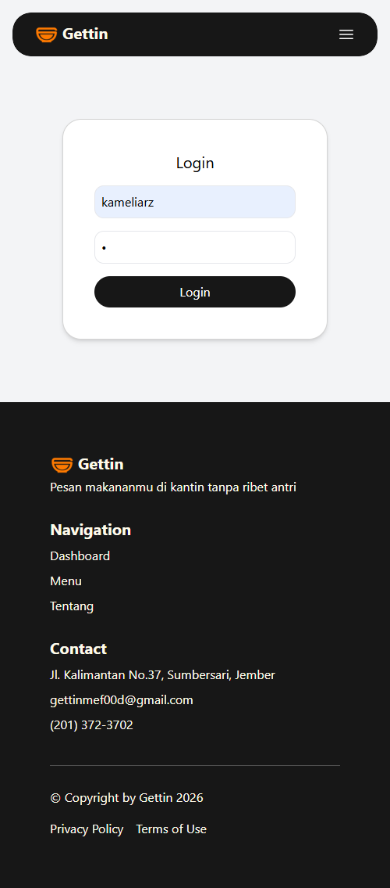
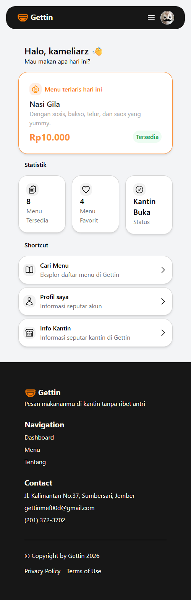
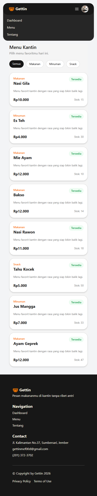
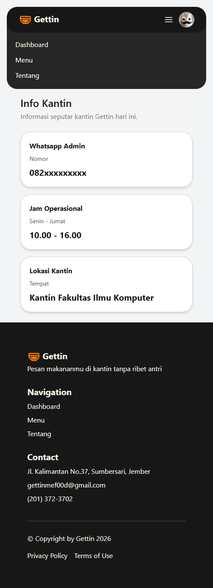
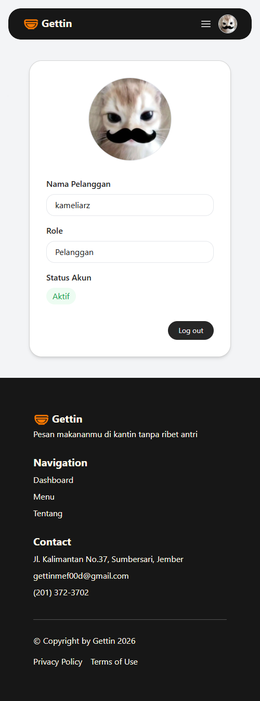

# UTS_PWEB_242410101058

## Deskripsi

Project ini adalah aplikasi web sederhana menggunakan Laravel dengan konsep MVC.
Web ini dibuat untuk simulasi sistem kantin bernama **Gettin**, di mana user bisa login, melihat menu, dan melihat informasi kantin.

## Fitur

* Login sederhana
* Dashboard
* Halaman menu kantin
* Halaman profil
* Halaman info kantin
* Navbar dan footer responsive

## Konsep yang dipakai

* MVC (data dari controller ke view)
* Blade template (`@extends`, `@section`, dll)
* Session untuk simpan username
* Looping data dengan `@foreach`

## Screenshot

### Login

### Dashboard

### Menu

### Info Kantin

### Profile

